# 基于多智能体对抗精炼与知识约束验证的概念优化引擎设计方案

> 版本: 0.1
> 日期: 2025-08-11
> 作者: GitHub Copilot

## 1. 目标概述

为用户的模糊想法 (Idea Seed) 提供一个“概念完成器 (Idea Completion & Innovation Engine)”，通过多智能体协作与对抗迭代，将模糊方向逐步转化为：

- 明确的问题定义 / 需求描述
- 结构化的方案 / 架构 / 路线图
- 可验证的假设与风险提示
- 可选的格式化输出（Markdown、报告、视觉化结构声明、知识清单等）

核心价值：持续反问澄清 + 多模型对抗创新 + 知识库约束验证 + 语境自适应输出。

## 2. 流程总览

```
用户输入初始 Idea
    ↓
[Clarifier 反问澄清循环]
    ↓ (澄清完成，生成 Structured Idea Draft)
[Adversarial Iterat- Ope- O#### 9.2.2 最新特- Gemini 2.0 Flash Exp：实验版本，支持多模态输入与实时推理能力。
- Kimi：官方提供kimi-k2-0711-preview（128K上下文，具备超强代码和Agent能力的MoE架构模型），kimi-k2-turbo-preview（高速版本），kimi-thinking-preview（多模态思考模型），适合代码生成、Agent应用、深度推理任务。
- DeepSeek：DeepSeek-V3在 HumanEval / MATH 等基准表现高，API 定价（折扣期）低，官方API名称为deepseek-chat；DeepSeek-R1官方API名称为deepseek-reasoner，提供类似"内建思维链"强化复杂推理，对标OpenAI o1。

#### 9.2.3 扩展 model_registry 示例（带新模型）于2025年官方发布信息）

- OpenAI GPT-5：2025年发布的旗舰模型，400k上下文长度，128k最大输出，支持文本和视觉，具备推理能力。
- OpenAI GPT-5 mini：更快更便宜的GPT-5版本，适合明确定义的任务，同样支持400k上下文。
- OpenAI GPT-5 nano：最快最便宜的GPT-5版本，专用于摘要和分类任务。
- Claude Opus 4.1：2025年8月发布，最强推理能力与扩展思考，200K上下文，训练数据截至2025年3月。
- Claude Sonnet 4：高性能模型，平衡推理能力和效率，200K上下文。
- Gemini 2.5 Pro：编码和交互式Web应用构建方面显著提升（具体API名称需要验证）。
- Kimi K2：长思考模型，支持超长上下文（具体API名称需要验证）。
- DeepSeek-V3-0324：借鉴R1强化学习技术，提升推理任务表现。
- DeepSeek-R1：专注推理任务，支持链式思考，性能对标OpenAI o1。1-preview / o1-mini：强调多步推理，128K 上下文；推理过程额外 token 计费，适合复杂结构化规划 / 验证前提抽取。
- Claude Opus 4.1：2025年8月最新发布，最强推理能力与扩展思考，200K上下文，训练数据截至2025年3月。
- Claude Sonnet 4：高性能平衡版本，快速响应与强推理兼得，适合生产环境。
- Gemini 2.0 Flash Exp：实验版本，支持多模态输入与实时推理能力。
- Kimi：长上下文窗口扩展至约 200 万汉字（≈1.4M tokens），适合超长文档整合、知识库摘要、代码库扫描。
- DeepSeek-V3：在 HumanEval / MATH 等基准表现高，API 定价（折扣期）低；DeepSeek-R1 提供类似"内建思维链"强化复杂推理。1-preview / o1-mini：强调多步推理，128K 上下文；推理过程额外 token 计费，适合复杂结构化规划 / 验证前提抽取。
- Claude Opus 4.1：2025年8月最新发布，最强推理能力与扩展思考，200K上下文，训练数据截至2025年3月。
- Claude Sonnet 4：高性能平衡版本，快速响应与强推理兼得，适合生产环境。
- Gemini 2.0 Flash Exp：实验版本，支持多模态输入与实时推理能力。
- Kimi：长上下文窗口扩展至约 200 万汉字（≈1.4M tokens），适合超长文档整合、知识库摘要、代码库扫描。
- DeepSeek-V3：在 HumanEval / MATH 等基准表现高，API 定价（折扣期）低；DeepSeek-R1 提供类似"内建思维链"强化复杂推理。efinement 对抗迭代]
    ├─ Innovator (扩展 / 发散 / 创新)
    ├─ Critic (批判 / 辩难 / 约束)
    └─ Synthesizer (综合 / 归并 / 版本推进)
    ↓ (收敛至 vN)
[Verifier 知识&逻辑验证]
    ├─ 逻辑一致性检查
    ├─ 事实核验（结构化知识 / 文档 / 向量库 / URL）
    ├─ 风险 & 盲点提示
    ↓ (生成 Verified Spec)
[Summarizer 输出适配]
    ├─ Markdown 报告
    ├─ 普通答复
    ├─ 可视化描述（Mermaid / 表格 / JSON Schema 等）
    └─ 可配置模板
    ↓
最终输出 (可含多视图 + 导出)
```

## 3. 角色与职责 (Agents)

| Agent        | 角色定位            | 核心目标               | 关键策略                |
| ------------ | ------------------- | ---------------------- | ----------------------- |
| Clarifier    | 反问澄清者          | 抽取上下文与约束       | 分层提问 / 变量槽位化   |
| Innovator    | 创新生成者          | 发散 + 增量创意        | 类比推理 / 交叉域映射   |
| Critic       | 批判挑战者          | 发现漏洞 / 偏差 / 平庸 | 约束对齐 / 反例构造     |
| Synthesizer  | 迭代综合者          | 收敛版本               | 冲突合并 / 优先级裁剪   |
| Verifier     | 知识验证 + 逻辑护栏 | 减少幻觉 & 逻辑错误    | 显式证据链 / 事实定位   |
| Summarizer   | 输出格式器          | 适配用户需求呈现       | 模板渲染 / 视图编排     |
| Orchestrator | 流程调度            | 控制状态机 / 步骤决策  | 策略停止条件 / 资源预算 |
| NetProvider  | 联网信息提供者      | 实时检索与证据供给     | MCP 秘塔搜索 / 去重聚合 |

## 4. 数据结构 (核心抽象)

```mermaid
classDiagram
    class IdeaSeed { raw_text: str \n context_hints: list[str] \n domain?: str }
    class Clarification { qa_pairs: list[QAPair] \n open_slots: list[Slot] \n confidence: float }
    class IterationVersion { id: str \n summary: str \n deltas: list[str] \n rationale: str \n score: Scores }
    class Scores { novelty: float \n feasibility: float \n coherence: float }
    class VerificationReport { logic_checks: list[Check] \n fact_checks: list[FactCheck] \n risks: list[Risk] \n pass: bool }
    class OutputSpec { format: str \n sections: list[SectionSpec] \n visuals: list[VisualSpec] }
    class Evidence { source_id: str \n snippet: str \n relevance: float }
```



### 4.1 槽位化 (Slots)

在 Clarifier 阶段将模糊 Idea 抽象为槽位：

- 目标(Target)
- 受众(User / Stakeholder)
- 约束(Constraints: 时间 / 资源 / 技术栈)
- 产出形式(Deliverable Types)
- 价值指标(Success Metrics)
- 风险假设(Risk / Assumptions)
  这样可以驱动后续迭代的系统性补全。

## 5. 状态机与控制逻辑

```
STATE: INIT → CLARIFYING → CLARIFIED → ADV_ITERATING(loop) → VERIFIED → FORMATTING → DONE
```

停止条件：

- Clarifying: 槽位填充率 >= 阈值 或 用户手动确认
- Adversarial Iteration: 连续 K 轮改进分数提升 < ε | 达到最大轮数 | 用户提前终止
- Verification: 全部关键逻辑检查通过 或 给出需人工确认列表

## 6. 对抗迭代机制 (Adversarial Loop)

每一轮：

1. Innovator 基于上一版本 + 未充分指标生成改进提案 (Delta List)
2. Critic 针对 Delta 提出批评分类：
   - 逻辑漏洞
   - 可行性疑问
   - 新增风险
   - 价值不明显
3. Synthesizer 合并：
   - 接受 / 修改 / 丢弃 Delta
   - 更新版本分数（可通过嵌入模型或规则 + LLM 评估）
4. 记录变化向量 (Change Trace) 与评估矩阵 (novelty / coherence / risk_balance)

可选：引入第二种创新风格 (例如“保守优化” vs “激进突破”) 交叉。

## 7. 知识与验证模块

### 7.1 知识接入层

支持多种来源：

- 本地文档 (Markdown / PDF 转文本 / JSON)
- URL 抓取 (正文抽取 + 去重)
- 向量检索 (Embedding + Top-K Evidence)
- 结构化数据库 (通过注册的 Query Adapter)

### 7.2 验证方法

| 检查类型   | 说明                     | 技术策略                            |
| ---------- | ------------------------ | ----------------------------------- |
| 事实性引用 | 关键陈述需证据           | Claim-Evidence Pairing + 置信度评估 |
| 逻辑一致   | 前后定义/假设不冲突      | Constraint Propagation Prompt 模板  |
| 缺口检测   | 未覆盖核心槽位/指标      | Coverage Matrix 评估                |
| 风险充分   | 风险-缓解措施映射        | Risk-Mitigation Table 自动抽取      |
| 可行性评估 | 时间 / 资源 / 技术成熟度 | LLM 评分 + 规则 (如资源>上限)       |

### 7.3 事实核验 Prompt 样式（示意）

```
You are a fact verification agent.
Input Claims:
- C1: ...
Retrieved Evidence (source_id | snippet):
...
For each claim: classify {SUPPORTED, PARTIAL, UNSUPPORTED, NEED_CLARIFICATION} and provide justification + evidence ids.
Output JSON schema: {...}
```

### 7.x 技术栈设计（Technology Stack）

> 设计原则：跨平台桌面应用 / 高性能 Rust 后端 / 现代 Web 前端 / 模块化 / 可观测 / 成本可控

#### 1. 总体分层架构

```
[桌面应用层 - Tauri v2]
  - 前端：React 18 + TypeScript 5.6 + Vite 6 + TailwindCSS 4
  - 原生集成：系统托盘 / 全局快捷键 / 本地文件系统 / 操作系统API
  - 窗口管理：多窗口 / 自定义标题栏 / 系统集成
  - 通信：IPC (invoke/emit) + WebSocket实时流

[Rust后端层 - Tauri Core]
  - 运行时：Tokio 1.45+ (async/await + 并发任务管理)
  - 命令系统：Tauri Commands + 序列化 (serde_json)
  - 事件系统：Tauri Event System (前后端双向通信)
  - 插件系统：官方插件 (fs, shell, notification, updater)

[多智能体执行引擎]
  - Agent Runtime：Tokio异步并发 + TaskGroup管理
  - 对抗循环：并行Agent调度 + 版本迭代控制
  - 模型代理：统一Provider抽象 + 失败重试 + 速率控制
  - 状态管理：内存状态机 + 持久化同步

[知识检索与存储]
  - 向量数据库：Qdrant 1.12+ (内嵌模式/独立服务)
  - 嵌入模型：text-embedding-3-large / bge-large-zh-v1.5
  - 本地存储：SQLite 3.46+ (嵌入式) + WAL模式
  - 缓存层：内存缓存 (DashMap) + LRU淘汰策略

[配置与扩展]
  - 配置管理：TOML配置文件 + 热重载 (notify)
  - 插件架构：动态库加载 + Wasmtime运行时 (可选)
  - 模板引擎：Handlebars 5.0+ (Prompt模板)
  - 日志系统：tracing + tracing-subscriber (结构化日志)
```

#### 2. 核心技术选型表

| 层级            | 技术栈                       | 版本要求       | 选择理由                             |
| --------------- | ---------------------------- | -------------- | ------------------------------------ |
| **桌面框架**    | Tauri v2                     | 2.1+           | 跨平台 + 小体积 + 安全性 + Rust 性能 |
| **前端框架**    | React 18 + TypeScript        | React 18.3+    | 生态成熟 + 类型安全 + 开发效率       |
| **构建工具**    | Vite 6                       | 6.0+           | 极速热更新 + ESM 原生 + 插件丰富     |
| **样式方案**    | TailwindCSS 4 + Shadcn/ui    | TailwindCSS 4+ | 原子化 CSS + 组件库 + 现代设计       |
| **异步运行时**  | Tokio                        | 1.45+          | 高性能异步 + 生态完善 + 并发安全     |
| **数据库**      | SQLite (rusqlite) + Qdrant   | SQLite 3.46+   | 嵌入式 + 无服务器 + ACID + 向量检索  |
| **序列化**      | serde + serde_json           | serde 1.0+     | 零拷贝 + 类型安全 + 性能优异         |
| **HTTP 客户端** | reqwest                      | 0.12+          | 异步 + 连接池 + 中间件 + TLS         |
| **配置管理**    | config + notify              | config 0.14+   | 多格式支持 + 热重载 + 环境变量       |
| **日志系统**    | tracing + tracing-subscriber | tracing 0.1+   | 结构化 + 异步友好 + 链路追踪         |
| **模板引擎**    | handlebars                   | 5.0+           | 逻辑简单 + 安全沙箱 + Mustache 兼容  |
| **加密存储**    | ring + chacha20poly1305      | ring 0.17+     | 现代密码学 + 高性能 + 内存安全       |
| **任务调度**    | tokio-cron-scheduler         | 0.13+          | 异步调度 + Cron 表达式 + 时区支持    |
| **测试框架**    | rstest + tokio-test          | rstest 0.21+   | 参数化测试 + 异步测试 + 并发安全     |
| **打包工具**    | Docker v27.4.0 (现有版本)    | 27.4.0         | 容器化部署 + 多平台构建 + CI/CD 集成 |

#### 3. Tauri 应用架构

```rust
// Tauri应用主结构
use tauri::{App, AppHandle, Manager, State, Window};
use tokio::sync::{RwLock, mpsc};
use std::sync::Arc;

#[derive(Clone)]
pub struct AppState {
    pub agent_runtime: Arc<AgentRuntime>,
    pub config: Arc<RwLock<AppConfig>>,
    pub event_bus: mpsc::UnboundedSender<SystemEvent>,
}

// 主应用入口
#[tokio::main]
async fn main() {
    let app_state = AppState::new().await;

    tauri::Builder::default()
        .plugin(tauri_plugin_fs::init())
        .plugin(tauri_plugin_notification::init())
        .plugin(tauri_plugin_updater::Builder::new().build())
        .manage(app_state)
        .invoke_handler(tauri::generate_handler![
            start_concept_optimization,
            get_iteration_versions,
            export_result,
            update_model_config
        ])
        .setup(setup_app)
        .run(tauri::generate_context!())
        .expect("运行Tauri应用时发生错误");
}
```

#### 4. 异步 Agent 执行系统

基于 Tokio 的高并发 Agent 调度：

```rust
use tokio::{select, time::{timeout, Duration}};
use futures::future::join_all;

pub struct AgentRuntime {
    model_registry: Arc<RwLock<ModelRegistry>>,
    task_pool: tokio::task::JoinSet<AgentResult>,
    config: AgentConfig,
}

impl AgentRuntime {
    pub async fn run_adversarial_iteration(&self,
        context: ConceptContext) -> Result<IterationResult> {

        // 并行启动多个Agent
        let (innovator_tx, innovator_rx) = mpsc::channel(32);
        let (critic_tx, critic_rx) = mpsc::channel(32);
        let (synthesizer_tx, synthesizer_rx) = mpsc::channel(32);

        let tasks = join_all(vec![
            self.spawn_innovator(context.clone(), innovator_tx),
            self.spawn_critic(context.clone(), critic_tx),
            self.spawn_synthesizer(context.clone(), synthesizer_tx),
        ]);

        // 超时控制 + 结果聚合
        match timeout(Duration::from_secs(30), tasks).await {
            Ok(results) => self.synthesize_results(results).await,
            Err(_) => Err(AgentError::Timeout),
        }
    }

    async fn spawn_agent<T: Agent>(&self, agent: T, ctx: Context) -> AgentResult {
        let model = self.select_optimal_model(&agent.requirements()).await?;
        agent.execute(model, ctx).await
    }
}
```

#### 5. 模型 Provider 统一抽象

```rust
#[async_trait]
pub trait ModelProvider: Send + Sync {
    async fn chat(&self, request: ChatRequest) -> Result<ChatResponse>;
    async fn stream(&self, request: ChatRequest) -> Result<Stream<ChatChunk>>;
    async fn embed(&self, texts: Vec<String>) -> Result<Vec<Embedding>>;
    fn model_info(&self) -> ModelInfo;
}

// 工厂模式 + 动态选择
pub struct ModelRegistry {
    providers: HashMap<String, Box<dyn ModelProvider>>,
    fallback_chains: Vec<Vec<String>>,
}

impl ModelRegistry {
    pub async fn get_provider(&self, model_id: &str) -> Result<&dyn ModelProvider> {
        self.providers.get(model_id)
            .or_else(|| self.get_fallback(model_id))
            .ok_or(ModelError::NotFound)
    }

    // 智能降级策略
    pub async fn execute_with_fallback<F, R>(&self,
        preferred_models: &[&str],
        operation: F) -> Result<R>
    where
        F: Fn(&dyn ModelProvider) -> BoxFuture<'_, Result<R>>,
    {
        for model_id in preferred_models {
            match self.get_provider(model_id).await {
                Ok(provider) => {
                    match operation(provider).await {
                        Ok(result) => return Ok(result),
                        Err(e) if e.is_retryable() => continue,
                        Err(e) => return Err(e),
                    }
                }
                Err(_) => continue,
            }
        }
        Err(ModelError::AllProvidersFailed)
    }
}
```

#### 6. 嵌入式数据存储方案

```rust
// SQLite主存储 + 内存缓存
pub struct DataStore {
    db: Arc<SqlitePool>,
    vector_store: Arc<QdrantClient>,
    cache: Arc<DashMap<String, CachedValue>>,
}

impl DataStore {
    pub async fn new() -> Result<Self> {
        // 嵌入式SQLite配置
        let db = SqlitePoolOptions::new()
            .max_connections(20)
            .acquire_timeout(Duration::from_secs(3))
            .connect_with(
                SqliteConnectOptions::new()
                    .filename("concept_optimizer.db")
                    .journal_mode(SqliteJournalMode::Wal)
                    .synchronous(SqliteSynchronous::Normal)
                    .pragma("cache_size", "-64000") // 64MB缓存
            )
            .await?;

        // 内嵌Qdrant向量存储
        let vector_config = QdrantConfig {
            storage_path: "./data/vectors".into(),
            ..Default::default()
        };
        let vector_store = QdrantClient::from_config(&vector_config).await?;

        Ok(Self { db, vector_store, cache: Default::default() })
    }

    // 知识检索 Pipeline
    pub async fn retrieve_knowledge(&self,
        query: &str,
        filters: Vec<Filter>) -> Result<Vec<KnowledgeChunk>> {

        // 1. 生成查询向量
        let query_embedding = self.embed_text(query).await?;

        // 2. 向量检索
        let search_request = SearchRequest {
            collection_name: "knowledge_base".into(),
            vector: query_embedding,
            limit: 20,
            filter: Some(self.build_qdrant_filter(filters)),
            with_payload: Some(true.into()),
        };

        let search_result = self.vector_store.search_points(search_request).await?;

        // 3. 结果重排序 + 上下文合并
        let chunks = self.rerank_and_merge(search_result, query).await?;

        Ok(chunks)
    }
}
```

#### 7. 前端架构 (React + TypeScript)

```typescript
// Tauri命令绑定
import { invoke } from "@tauri-apps/api/core";
import { listen } from "@tauri-apps/api/event";

interface ConceptOptimizerAPI {
  startOptimization: (seed: IdeaSeed) => Promise<OptimizationSession>;
  getIterations: (sessionId: string) => Promise<IterationVersion[]>;
  exportResult: (sessionId: string, format: ExportFormat) => Promise<string>;
}

// React组件架构
export const ConceptOptimizerApp: React.FC = () => {
  const [session, setSession] = useState<OptimizationSession | null>(null);
  const [iterations, setIterations] = useState<IterationVersion[]>([]);
  const [streaming, setStreaming] = useState(false);

  // 监听后端事件流
  useEffect(() => {
    const unlisten = listen<IterationUpdate>("iteration-update", (event) => {
      setIterations((prev) => [...prev, event.payload.iteration]);
    });

    return () => {
      unlisten.then((fn) => fn());
    };
  }, []);

  // Tauri命令调用
  const startOptimization = async (ideaSeed: IdeaSeed) => {
    setStreaming(true);
    try {
      const session = await invoke<OptimizationSession>(
        "start_concept_optimization",
        { seed: ideaSeed }
      );
      setSession(session);
    } catch (error) {
      console.error("优化启动失败:", error);
    } finally {
      setStreaming(false);
    }
  };

  return (
    <div className="min-h-screen bg-gradient-to-br from-slate-50 to-slate-100">
      <TitleBar />
      <main className="container mx-auto px-4 py-6">
        <ConceptInput onSubmit={startOptimization} disabled={streaming} />
        {session && (
          <IterationViewer
            session={session}
            iterations={iterations}
            onExport={handleExport}
          />
        )}
      </main>
      <SystemTray />
    </div>
  );
};
```

#### 8. 配置管理与热更新

```rust
// 配置热重载系统
use notify::{Watcher, RecursiveMode, watcher};
use serde::{Deserialize, Serialize};

#[derive(Debug, Clone, Deserialize, Serialize)]
pub struct AppConfig {
    pub models: ModelRegistryConfig,
    pub agents: AgentConfig,
    pub performance: PerformanceConfig,
    pub ui: UIConfig,
}

pub struct ConfigManager {
    config: Arc<RwLock<AppConfig>>,
    watcher: RecommendedWatcher,
    event_tx: mpsc::UnboundedSender<ConfigEvent>,
}

impl ConfigManager {
    pub async fn new(config_path: &Path) -> Result<Self> {
        let (tx, mut rx) = mpsc::unbounded_channel();
        let config = Arc::new(RwLock::new(Self::load_config(config_path).await?));

        // 文件监听
        let mut watcher = watcher(tx.clone(), Duration::from_secs(1))?;
        watcher.watch(config_path, RecursiveMode::NonRecursive)?;

        // 后台任务处理配置更新
        let config_clone = config.clone();
        tokio::spawn(async move {
            while let Some(event) = rx.recv().await {
                if let Ok(new_config) = Self::load_config(config_path).await {
                    *config_clone.write().await = new_config;
                    tracing::info!("配置已热重载");
                }
            }
        });

        Ok(Self { config, watcher, event_tx: tx })
    }
}
```

#### 9. 系统监控与可观测性

```rust
// 分布式追踪
use tracing::{info, warn, error, instrument};
use tracing_subscriber::{layer::SubscriberExt, util::SubscriberInitExt};

pub fn init_tracing() {
    tracing_subscriber::registry()
        .with(tracing_subscriber::fmt::layer()
            .with_file(true)
            .with_line_number(true)
            .with_thread_ids(true)
            .json())
        .with(tracing_subscriber::filter::EnvFilter::from_default_env())
        .init();
}

// 性能指标收集
#[derive(Debug, Clone)]
pub struct Metrics {
    pub iteration_count: AtomicU64,
    pub avg_iteration_time: AtomicU64,
    pub model_usage: DashMap<String, ModelUsage>,
    pub error_count: AtomicU64,
}

impl Metrics {
    #[instrument(skip(self))]
    pub async fn record_iteration(&self, duration: Duration, model_id: &str) {
        self.iteration_count.fetch_add(1, Ordering::Relaxed);
        self.update_avg_time(duration).await;
        self.record_model_usage(model_id).await;

        info!(
            iteration_time_ms = duration.as_millis(),
            model = model_id,
            "完成对抗迭代"
        );
    }
}
```

#### 10. 安全与权限控制

```rust
// 安全存储
use chacha20poly1305::{ChaCha20Poly1305, Key, Nonce};
use rand::{rngs::OsRng, RngCore};

pub struct SecureStorage {
    cipher: ChaCha20Poly1305,
    key_derivation: Arc<dyn KeyDerivation>,
}

impl SecureStorage {
    pub fn encrypt_api_key(&self, plaintext: &str) -> Result<Vec<u8>> {
        let mut nonce_bytes = [0u8; 12];
        OsRng.fill_bytes(&mut nonce_bytes);
        let nonce = Nonce::from_slice(&nonce_bytes);

        let ciphertext = self.cipher
            .encrypt(nonce, plaintext.as_bytes())
            .map_err(|_| SecurityError::EncryptionFailed)?;

        Ok([nonce_bytes.to_vec(), ciphertext].concat())
    }

    pub fn decrypt_api_key(&self, ciphertext: &[u8]) -> Result<String> {
        let (nonce_bytes, encrypted) = ciphertext.split_at(12);
        let nonce = Nonce::from_slice(nonce_bytes);

        let plaintext = self.cipher
            .decrypt(nonce, encrypted)
            .map_err(|_| SecurityError::DecryptionFailed)?;

        String::from_utf8(plaintext)
            .map_err(|_| SecurityError::InvalidEncoding)
    }
}

// Tauri权限配置
// tauri.conf.json
{
  "permissions": [
    "core:window:allow-create",
    "core:event:allow-emit",
    "fs:allow-read-text-file",
    "fs:allow-write-text-file",
    "notification:allow-request-permission",
    "shell:allow-open"
  ],
  "scope": {
    "fs": {
      "allow": ["$APPDATA/concept-optimizer/**"]
    }
  }
}
```

#### 11. 构建与部署

```bash
# 开发环境启动
npm run tauri dev

# 生产构建 (多平台)
npm run tauri build

# Docker多阶段构建 (用于CI/CD)
FROM rust:1.83-slim as builder
RUN apt-get update && apt-get install -y \
    pkg-config libssl-dev libwebkit2gtk-4.0-dev \
    build-essential curl wget libssl-dev \
    libgtk-3-dev libappindicator3-dev librsvg2-dev

WORKDIR /app
COPY . .
RUN cargo build --release

# 运行时镜像
FROM debian:bookworm-slim
RUN apt-get update && apt-get install -y webkit2gtk-4.0
COPY --from=builder /app/target/release/concept-optimizer /usr/local/bin/
CMD ["concept-optimizer"]
```

#### 12. 性能基线 (基于 Docker v27.4.0)

| 指标            | 目标值  | 备注                         |
| --------------- | ------- | ---------------------------- |
| 应用启动时间    | < 2s    | 冷启动到界面可用             |
| 单轮对抗迭代    | < 8s    | 3 个 Agent 并行执行          |
| 向量检索延迟    | < 300ms | Top-20 结果 + Rerank         |
| 内存占用        | < 200MB | 包含向量索引和模型缓存       |
| 磁盘占用        | < 50MB  | 应用本体 (不含数据)          |
| 并发会话支持    | 5 个    | 单用户多概念并行优化         |
| 配置热重载响应  | < 500ms | 文件变更到生效               |
| Docker 镜像大小 | < 200MB | 生产镜像 (基于 v27.4.0 构建) |

#### 13. 扩展点与插件系统

```rust
// WASM插件运行时 (可选)
use wasmtime::{Engine, Module, Store, Instance};

pub struct PluginRuntime {
    engine: Engine,
    plugins: HashMap<String, CompiledPlugin>,
}

// 自定义Agent插件接口
#[async_trait]
pub trait AgentPlugin: Send + Sync {
    fn name(&self) -> &str;
    fn version(&self) -> &str;
    async fn execute(&self, context: PluginContext) -> PluginResult;
    fn capabilities(&self) -> Vec<Capability>;
}

// 动态加载
impl PluginRuntime {
    pub async fn load_plugin(&mut self, path: &Path) -> Result<()> {
        let module = Module::from_file(&self.engine, path)?;
        let plugin = CompiledPlugin::new(module)?;
        self.plugins.insert(plugin.name().to_string(), plugin);
        Ok(())
    }
}
```

#### 14. 开发工具链

```bash
# 依赖安装
curl --proto '=https' --tlsv1.2 -sSf https://sh.rustup.rs | sh
npm install -g @tauri-apps/cli@next

# 项目初始化
npm create tauri-app@latest -- --alpha
cd concept-optimizer
npm install

# 开发服务器
npm run tauri dev

# 单元测试
cargo test --all-features
npm test

# 端到端测试
npm run test:e2e

# 性能分析
cargo bench
npm run benchmark

# 代码质量
cargo clippy --all-targets --all-features
cargo fmt --all
npm run lint
npm run typecheck
```

此技术栈设计基于 Tauri v2 框架，充分利用 Rust 的性能优势和现代 Web 技术的开发效率，确保跨平台桌面应用的高性能、安全性和用户体验。

## 8. Prompt 体系 (模块化)

| 模块        | Prompt 核心要素                       | 输出格式                 |
| ----------- | ------------------------------------- | ------------------------ |
| Clarifier   | 角色 + 槽位列表 + 已知回答 + 未填槽位 | JSON(QA / missing_slots) |
| Innovator   | 上一版本 + 指标短板 + 方向策略        | 改进要点列表 + 理由      |
| Critic      | 改进要点 + 接受标准                   | 分类批评 JSON            |
| Synthesizer | 原版本 + 批评 + 接受策略              | 新版本 + 变更摘要        |
| Verifier    | 版本内容 + 证据                       | 验证报告 JSON            |
| Summarizer  | Verified Spec + 用户输出要求          | Markdown / 其它模板      |

## 9. 配置与可扩展性

```yaml
engine:
  clarify:
    max_rounds: 5
    min_slot_fill: 0.8
  iteration:
    max_rounds: 8
    min_improvement: 0.03
    scorers: [novelty, feasibility, coherence]
  verification:
    evidence_top_k: 6
    strict_mode: false
  output:
    default_format: markdown
models:
  clarifier: gpt-5-mini # 2025年发布，快速且成本效益高，适合明确任务
  innovator: mix(gpt-5, claude-sonnet-4-20250514) # GPT-5旗舰 + Claude Sonnet 4高性能
  critic: claude-opus-4-1-20250805 # 2025年8月最新旗舰，最强推理能力
  verifier: claude-opus-4-1-20250805
  summarizer: gpt-5-nano # 最快最便宜，专用于摘要任务
  net_provider: mcp:metaso_search # 通过秘塔搜索 MCP 工具，必须至少存在一个
retrieval:
  embed_model: text-embedding-3-large
  chunk_size: 1200
  overlap: 150
personality_profiles:
  rigorous:
    iteration.max_rounds: 5
    iteration.min_improvement: 0.01
    weights: { critic: 1.3, innovator: 0.8, verifier: 1.4 }
    risk_tolerance: low
  balanced:
    iteration.max_rounds: 6
    iteration.min_improvement: 0.02
    weights: { critic: 1.0, innovator: 1.0, verifier: 1.0 }
    risk_tolerance: medium
  innovative:
    iteration.max_rounds: 9
    iteration.min_improvement: 0.04
    weights: { critic: 0.8, innovator: 1.4, verifier: 0.9 }
    risk_tolerance: high
```

### 9.1 模型注册与动态选择机制

用户可在“设置界面 / 配置文件”中预注册多个可选模型（DeepSeek、OpenAI、Gemini、Kimi(Moonshot)、Anthropic Claude、以及本地 GGUF/ONNX/vLLM 部署等）。系统在动态生成智能体群时基于任务上下文 + 角色需求 + 成本/延迟/能力约束自适配挑选最优模型组合；同一角色不同轮次可切换模型以优化收敛效率与多样性。

#### 9.1.1 模型注册结构

```yaml
model_registry:
  - id: openai:gpt-4o
    provider: openai
    api_base: https://api.openai.com/v1
    max_context: 128k
    strengths:
      {
        reasoning: 0.9,
        creativity: 0.7,
        grounding: 0.85,
        speed: 0.6,
        cost: 0.4,
      }
    preferred_roles: [clarifier, critic, verifier, summarizer]
  - id: deepseek:chat # 官方API名称，调用DeepSeek-V3
    provider: deepseek
    api_base: https://api.deepseek.com/v1
    max_context: 128k # 官方确认：DeepSeek-V3支持128K上下文
    strengths:
      {
        reasoning: 0.88,
        creativity: 0.9,
        grounding: 0.75,
        speed: 0.7,
        cost: 0.8,
      }
    preferred_roles: [innovator, clarifier]
  - id: google:gemini-2.0-flash-thinking-exp-0115 # 基于官方发布日期命名
    provider: google
    max_context: 1M
    strengths:
      {
        reasoning: 0.85,
        creativity: 0.8,
        grounding: 0.75,
        speed: 0.72,
        cost: 0.5,
      }
    preferred_roles: [innovator, verifier, summarizer]
  - id: moonshot:kimi-k2-0711-preview # 官方确认API名称
    provider: moonshot
    max_context: 128k # 官方确认：128K上下文
    strengths: {
        reasoning: 0.90, # 具备超强代码和Agent能力的MoE架构
        creativity: 0.82,
        grounding: 0.85,
        speed: 0.50,
        cost: 0.48,
      }
    preferred_roles: [clarifier, verifier, innovator]
  - id: moonshot:kimi-thinking-preview # 官方确认API名称
    provider: moonshot
    max_context: 128k # 官方确认：支持128K上下文
    strengths: {
        reasoning: 0.94, # 具有多模态推理能力
        creativity: 0.85,
        grounding: 0.88,
        speed: 0.45,
        cost: 0.50,
      }
    preferred_roles: [critic, verifier, innovator]
  - id: anthropic:claude-opus-4-1
    provider: anthropic # Claude 4.1 最新旗舰
    max_context: 200k
    strengths:
      {
        reasoning: 0.95,
        creativity: 0.82,
        grounding: 0.92,
        speed: 0.5,
        cost: 0.3,
      }
    preferred_roles: [critic, verifier, innovator]
  - id: anthropic:claude-sonnet-4
    provider: anthropic # Claude 4 高性能版
    max_context: 200k
    strengths:
      {
        reasoning: 0.92,
        creativity: 0.8,
        grounding: 0.9,
        speed: 0.65,
        cost: 0.6,
      }
    preferred_roles: [clarifier, critic, verifier, summarizer]
  - id: local:llama3-8b-q4
    provider: local
    runtime: ggml
    path: /models/llama3-8b-q4.gguf
    max_context: 16k
    strengths:
      {
        reasoning: 0.55,
        creativity: 0.65,
        grounding: 0.4,
        speed: 0.8,
        cost: 0.1,
      }
    preferred_roles: [draft, auxiliary]

selection_policies:
  default:
    creative_bias: 0.3 # 提高对 creativity 高模型权重
    reasoning_bias: 0.3
    grounding_bias: 0.2
    latency_bias: 0.1
    cost_bias: 0.1
  rigorous:
    creative_bias: 0.1
    reasoning_bias: 0.35
    grounding_bias: 0.3
    latency_bias: 0.15
    cost_bias: 0.1
  innovative:
    creative_bias: 0.4
    reasoning_bias: 0.2
    grounding_bias: 0.15
    latency_bias: 0.1
    cost_bias: 0.15
```

#### 9.2 最新模型与 API 参考（更新日期：2025-08）

本节基于当前（2025-08）公开资讯/搜索结果整理，数值为相对能力归一化(0~1)启发式估计，仅用于调度权重参考；正式上线需以官方文档校准（价格/上下文长度/速率限制以官方为准）。

#### 9.2.1 主要闭源 / 托管模型现状

| 提供商          | 代表模型 (2025 最新官方确认)                                                    | 典型上下文                      | 特色                                              | 主要适配角色建议                                 |
| --------------- | ------------------------------------------------------------------------------- | ------------------------------- | ------------------------------------------------- | ------------------------------------------------ |
| OpenAI          | GPT-5, GPT-5 mini, GPT-5 nano                                                   | 400K 上下文，128K 最大输出      | GPT-5 旗舰推理能力，mini/nano 成本优化            | Clarifier / Critic / Verifier / 深推理 Innovator |
| Anthropic       | Claude Opus 4.1, Sonnet 4, Sonnet 3.7                                           | 200K                            | Opus 4.1 最强能力，Sonnet 4 高性能平衡            | Critic / Verifier / Innovator                    |
| Google (Gemini) | Gemini 2.5 Pro, 2.0 Flash 系列                                                  | 1M-2M                           | 2.5 Pro 编码能力突出，2.0 多模态实时推理          | NetProvider（多模态场景）/ Innovator             |
| DeepSeek        | deepseek-chat, deepseek-reasoner                                                | chat ~128K，reasoner 推理链扩展 | chat 通用高性价比，reasoner 推理增强对标 o1       | Innovator / Cost-Optimized Critic                |
| Kimi (Moonshot) | kimi-k2-0711-preview, kimi-k2-turbo-preview, kimi-latest, kimi-thinking-preview | 128K 标准上下文，支持多模态     | K2 具备超强代码 Agent 能力，thinking 支持深度推理 | Clarifier / Verifier / 代码生成 Innovator        |
| 本地 (开源)     | Llama3 家族 / Mistral / Phi-3 等                                                | 4K~128K 取决于量化/实现         | 成本可控 / 可私有化                               | Draft / 辅助 Summarizer / 低风险阶段             |

#### 9.2.2 最新特性速览（摘自近期动态）

- OpenAI o1-preview / o1-mini：强调多步推理，128K 上下文；推理过程额外 token 计费，适合复杂结构化规划 / 验证前提抽取。
- Claude Opus 4.1：2025 年 8 月最新发布，最强推理能力与扩展思考，200K 上下文，训练数据截至 2025 年 3 月。
- Gemini 2.0 Flash Exp：实验版本，支持多模态输入与实时推理能力。
- Kimi：长上下文窗口扩展至约 200 万汉字（≈1.4M tokens），适合超长文档整合、知识库摘要、代码库扫描。
- DeepSeek-V3：在 HumanEval / MATH 等基准表现高，API 定价（折扣期）低；DeepSeek-R1 提供类似“内建思维链”强化复杂推理。

#### 9.2.3 扩展 model_registry 示例（带新模型）

```yaml
model_registry:
  - id: openai:gpt-5
    provider: openai
    max_context: 400k # 官方确认：400k上下文长度
    strengths: {
        reasoning: 0.96, # 旗舰模型，最强推理能力
        creativity: 0.85,
        grounding: 0.94,
        speed: 0.55,
        cost: 0.32, # 基于官网$1.25输入/$10输出per 1M tokens
      }
    notes: "2025年发布旗舰模型，支持文本和视觉，具备推理能力"
    preferred_roles: [critic, verifier, innovator]
  - id: openai:gpt-5-mini
    provider: openai
    max_context: 400k # 官方确认：400k上下文长度
    strengths: {
        reasoning: 0.93,
        creativity: 0.82,
        grounding: 0.91,
        speed: 0.72,
        cost: 0.65, # 基于官网$0.25输入/$2输出per 1M tokens
      }
    notes: "更快更便宜的GPT-5版本，适合明确定义的任务"
    preferred_roles: [clarifier, innovator]
  - id: openai:gpt-5-nano
    provider: openai
    max_context: 400k # 官方确认：400k上下文长度
    strengths: {
        reasoning: 0.88,
        creativity: 0.75,
        grounding: 0.85,
        speed: 0.88,
        cost: 0.85, # 基于官网$0.05输入/$0.40输出per 1M tokens
      }
    notes: "最快最便宜版本，专用于摘要和分类任务"
    preferred_roles: [summarizer, clarifier]
  - id: anthropic:claude-opus-4-1-20250805
    provider: anthropic
    max_context: 200k
    strengths: {
        reasoning: 0.98, # 官方称为最强能力模型
        creativity: 0.85,
        grounding: 0.96,
        speed: 0.45,
        cost: 0.28, # 基于官网$15输入/$30输出per 1M tokens
      }
    notes: "2025年8月发布，最强推理能力与扩展思考"
    preferred_roles: [critic, verifier, synthesizer]
  - id: anthropic:claude-sonnet-4-20250514
    provider: anthropic
    max_context: 200k
    strengths: {
        reasoning: 0.94,
        creativity: 0.82,
        grounding: 0.93,
        speed: 0.75,
        cost: 0.52, # 基于官网$3输入/$6输出per 1M tokens
      }
    notes: "高性能模型，平衡推理能力和效率"
    preferred_roles: [clarifier, critic, verifier, summarizer]
  - id: anthropic:claude-3-7-sonnet-20250219
    provider: anthropic
    max_context: 200k
    strengths:
      {
        reasoning: 0.91,
        creativity: 0.80,
        grounding: 0.90,
        speed: 0.78,
        cost: 0.52,
      }
    notes: "高性能模型，具备早期扩展思考功能"
    preferred_roles: [clarifier, innovator, summarizer]
  - id: google:gemini-2.5-pro-preview-0625 # 基于官方命名规范推测
    provider: google
    max_context: 2M
    strengths:
      {
        reasoning: 0.93,
        creativity: 0.85,
        grounding: 0.85,
        speed: 0.52,
        cost: 0.48,
      }
    notes: "基于官方命名规范推测的API名称，编码和交互式Web应用构建显著提升"
    preferred_roles: [innovator, verifier, netprovider]
  - id: moonshot:kimi-k2-0711-preview # 官方确认API名称
    provider: moonshot
    max_context: 128k # 官方确认：128K上下文
    strengths: {
        reasoning: 0.90, # 具备超强代码和Agent能力的MoE架构
        creativity: 0.82,
        grounding: 0.85,
        speed: 0.50, # 基础版本相对较慢
        cost: 0.48,
      }
    notes: "官方API名称，具备超强代码和Agent能力的MoE架构基础模型，总参数1T，激活参数32B"
    preferred_roles: [clarifier, verifier, innovator]
  - id: moonshot:kimi-k2-turbo-preview # 官方确认API名称
    provider: moonshot
    max_context: 128k # 官方确认：与kimi-k2一致
    strengths: {
        reasoning: 0.90, # 与k2能力一致
        creativity: 0.82,
        grounding: 0.85,
        speed: 0.80, # 输出速度从每秒10提升至40 Tokens
        cost: 0.45,
      }
    notes: "官方API名称，kimi-k2的高速版，输出速度每秒10 Tokens提升至每秒40 Tokens"
    preferred_roles: [clarifier, summarizer, netprovider]
  - id: moonshot:kimi-latest # 官方确认API名称
    provider: moonshot
    max_context: 128k # 官方确认：最长支持128K上下文
    strengths:
      {
        reasoning: 0.86,
        creativity: 0.82,
        grounding: 0.85,
        speed: 0.58,
        cost: 0.52,
      }
    notes: "官方API名称，最长支持128K上下文的视觉模型，支持图片理解，使用最新的Kimi大模型版本"
    preferred_roles: [clarifier, verifier, summarizer]
  - id: moonshot:kimi-thinking-preview # 官方确认API名称
    provider: moonshot
    max_context: 128k # 官方确认：支持128K上下文
    strengths: {
        reasoning: 0.94, # 具有多模态推理能力
        creativity: 0.85,
        grounding: 0.88,
        speed: 0.45, # 思考模型相对较慢
        cost: 0.50,
      }
    notes: "官方API名称，具有多模态推理能力和通用推理能力的多模态思考模型，支持深度推理"
    preferred_roles: [critic, verifier, innovator]
  - id: deepseek:chat # 官方确认API名称，实际调用DeepSeek-V3
    provider: deepseek
    max_context: 128k
    strengths:
      {
        reasoning: 0.91,
        creativity: 0.84,
        grounding: 0.78,
        speed: 0.70,
        cost: 0.82,
      }
    notes: "官方API名称为deepseek-chat，实际调用DeepSeek-V3-0324模型"
    preferred_roles: [innovator, critic]
  - id: deepseek:reasoner # 官方确认API名称，即DeepSeek-R1
    provider: deepseek
    max_context: 64k
    strengths: {
        reasoning: 0.95, # 对标OpenAI o1
        creativity: 0.78,
        grounding: 0.76,
        speed: 0.55,
        cost: 0.68,
      }
    notes: "官方API名称为deepseek-reasoner，即DeepSeek-R1，专注推理任务，支持链式思考"
    preferred_roles: [critic, verifier, innovator]
  - id: local:llama3-70b-instruct
    provider: local
    max_context: 16k
    strengths:
      {
        reasoning: 0.7,
        creativity: 0.68,
        grounding: 0.55,
        speed: 0.45,
        cost: 0.15,
      }
    preferred_roles: [draft, summarizer, auxiliary]
```

#### 9.2.4 API 访问注意事项摘要

| 提供商             | 认证                     | 速率控制                   | 特殊点                                           |
| ------------------ | ------------------------ | -------------------------- | ------------------------------------------------ |
| OpenAI             | Bearer Key               | 每模型/组织限速            | o1 额外推理 token 计费、可 JSON schema 输出      |
| Anthropic          | x-api-key                | token+请求数限制           | 支持 system + messages + metadata；可 citations  |
| Google Gemini      | API Key / OAuth (Vertex) | 项目配额                   | 多模态（图/视频/文件）上传；JSON mode            |
| DeepSeek           | Bearer Key               | 速率分层（折扣期可能不同） | V3/R1 区分推理 vs 通用；部分路径 OpenAI 兼容     |
| Moonshot Kimi      | API Key                  | 按上下文+输出计费          | K2 系列 128K 上下文，支持代码 Agent 和多模态推理 |
| 本地 (vLLM/Ollama) | 无/自定义                | 由本地限流                 | 可通过 OpenAI 兼容端点统一封装                   |

#### 9.2.5 动态更新策略

1. 启动时拉取“providers.json”远程指纹，对比本地缓存决定刷新。
2. 针对 pricing/context 维护 TTL（例如 24h）；临近过期异步刷新不阻塞主流程。
3. 发现新提供商或模型 ID（日志中出现未识别 ID）→ 触发半自动注册向导。
4. 重要字段变动（max_context / pricing）→ 触发调度权重重算并记录事件。

#### 9.2.6 调度权重再校准

当新增模型：

```pseudo
for attr in strengths:
  normalize attr 值到 [0,1] (基于分位数而非极值防异常)
重算 base_score → 若新模型领先 > δ，触发探索 (bandit) 标签
```

#### 9.2.7 风险与校验

- 第三方转载信息可能滞后：定期与官方 changelog / pricing endpoint 对比。
- 估值归一化失真：采用滑动窗口加权分位更新。
- 超长上下文内存占用：对 1M 窗口模型启用分块裁剪策略；预估 token 前先做 chunk 预算。
- 推理模型成本膨胀：o1 / R1 / reasoning 模型引入“推理 token 上限”警戒阈。

> 若检测到核心模型全部失效（连续 N 次 API 错误），Orchestrator 进入降级模式：仅启用本地模型 + 最后成功的远程模型缓存响应策略。

## 10. API 设计 (初稿)

### 10.1 高层接口

```python
class IdeaEngine:
    def run(self, seed: str, *, output_format: str|None=None, knowledge_sources: list=None, callbacks: dict=None) -> EngineResult: ...
```

### 10.2 回调点 (可观察性)

- on_slot_update(Clarification)
- on_iteration(version: IterationVersion)
- on_verification(report: VerificationReport)
- on_output(rendered: str)

### 10.3 EngineResult

```python
@dataclass
class EngineResult:
    final_output: str
    versions: list[IterationVersion]
    verification: VerificationReport
    clarification: Clarification
    artifacts: dict  # e.g., {"mermaid": "...", "risk_table": "..."}
```

## 11. 评分与评价策略

| 指标                 | 描述             | 自动化方式                      |
| -------------------- | ---------------- | ------------------------------- |
| Novelty              | 新颖度           | LLM Pairwise vs Baseline        |
| Feasibility          | 可实现性         | 规则 + LLM 评分                 |
| Clarity              | 表达清晰度       | 可读性评分 + 槽位填充率         |
| Evidence Coverage    | 证据覆盖率       | supported_claims / total_claims |
| Iteration Efficiency | 每轮有效提升幅度 | Δscore / 回合                   |

## 12. 风险与缓解

| 风险             | 影响         | 缓解策略                     |
| ---------------- | ------------ | ---------------------------- |
| 幻觉引用         | 误导用户     | 强制证据 ID + 无证据标红     |
| 无限迭代         | 资源浪费     | 改进停滞阈值 + Budget 计数器 |
| 创新过度脱离约束 | 不可实施     | Critic 加强约束模板          |
| Prompt 脆弱      | 输出漂移     | 模板版本化 / 回归测试        |
| 知识库噪声       | 错误验证结果 | 文档预清洗 + 相似度阈值      |

## 13. 日志与可观测性

结构化日志字段：timestamp / phase / agent / action / duration_ms / tokens / score_delta / warnings。
可选：引入事件总线 (e.g. pydantic model -> JSON lines)。

## 14. 性能与成本控制

- 批量并行：Innovator 可并行多风格候选再合并
- Response 缓存：相同 Prompt+上下文 Hash
- 分层检索：先粗召回后精 rerank
- 自适应截断：长文档只保留高 TF-IDF + Embedding TopSpan

## 15. 输出模式示例

1. Markdown 报告：
   - 摘要 / 目标 / 约束 / 方案结构 / 路线 / 风险表 / 证据附录
2. 可视化：
   - Mermaid: 流程 / 架构 / 依赖
3. JSON Schema：
   - deliverable_spec.json
4. 混合：交互式前端可接收 sections[] 元信息渲染。

## 16. 最小可行版本 (MVP) 范围

| 功能         | MVP                     | 以后扩展                   |
| ------------ | ----------------------- | -------------------------- |
| Clarifier    | 基础槽位 + 3 轮         | 动态自适应问数             |
| Iteration    | 单 Innovator + Critic   | 多创新风格 + 量化评分模型  |
| Verification | 基础事实检索 + 支持判定 | 逻辑图推断 / Symbolic 校验 |
| 输出         | Markdown                | 多模板 / 图形化组件        |
| 知识源       | 本地 + URL              | DB / API 适配器注册        |

## 17. 开发里程碑 (建议)

| Sprint | 目标                  | 交付                                  |
| ------ | --------------------- | ------------------------------------- |
| S1     | Clarifier + 数据结构  | 槽位抽取 + API Skeleton               |
| S2     | Iteration Loop MVP    | Innovator / Critic / Synthesizer 简版 |
| S3     | Verification 基础     | 检索 + Claim 校验格式                 |
| S4     | Summarizer + 输出模板 | Markdown 报告                         |
| S5     | 优化与测试            | 自动回归 / 评分仪表                   |

## 18. 测试策略

- 单测：数据结构 / 停止条件 / 分数计算
- 集成：全流程给定 Seed -> 终端输出
- 回归：固定随机种子 + Prompt Hash 比较漂移
- 评估：基准题集 (不同领域模糊想法) + 人工抽样评分

## 19. 未来扩展想法

- 插件化 Agent 注册 (entry_points)
- 强化学习调参：迭代策略 (选择何时激进)
- 知识图谱接入：概念对齐 / 语义补洞
- 结构化规划 -> 任务分解 -> 可执行指令序列
- 多用户协同：多人对同一 Idea 的分支合并

## 20. 简要伪代码

```python
def run_engine(seed: str, cfg: Config):
    clar = Clarifier(cfg)
    clar_state = clar.run(seed)

    versions = []
    current = seed_to_initial_version(clar_state)
    for r in range(cfg.iter.max_rounds):
        cand = Innovator(cfg).propose(current)
        critique = Critic(cfg).review(cand, current)
        current = Synthesizer(cfg).merge(current, cand, critique)
        versions.append(current)
        if not improved(versions, cfg.iter.min_improvement):
            break

    verified = Verifier(cfg).verify(current, knowledge_sources=cfg.knowledge)
    output = Summarizer(cfg).render(verified, clar_state, target_format=cfg.output.format)
    return EngineResult(output, versions, verified, clar_state, artifacts=collect_artifacts())
```

## 21. 结论

本设计通过“澄清—对抗—验证—适配”四层结构，使得从模糊到结构化创新方案的生产过程可控、可追踪、可扩展。后续实施时应优先保证数据结构与 Prompt 模板的稳定性，再演进性能与智能化程度。
